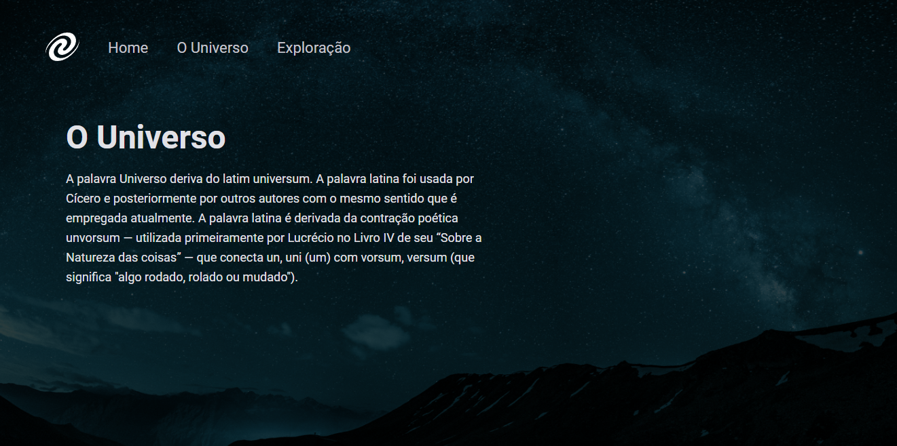

# SPA Universe 

> Trilha Explorer

Mais um desafio concluído com sucesso! Esse é o primeiro desafio do stage 6 - trilha Explorer da Rocketseat. Feito totalmente do zero a partir de um layout do figma, nele eu pudi colocar em prática vários novos conceitos adiquiridos no stage 6. Para fazer esse desafio eu usei : 

- Conceitos de SPA;
- Mapeamento de rotas;
- Assíncrono e promisses;
- Orientação a objetos;
- Classes e muito mais.

[🔗 Clique aqui para acessar](https://filipesantos07.github.io/Projeto-SPA-Universe/)

## 🛠️ Tecnologias

- HTML
- CSS
- JavaScript

## 💛 Contato

FilipeSantosEstudos1@gmail.com